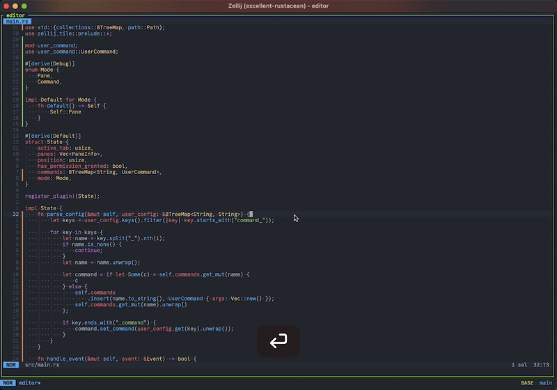

# zjpane

<p>
  Navigate between [zellij](https://zellij.dev/) panes easily.
  <br><br>
  <a href="https://github.com/furiouzz/zjpane/actions/workflows/lint.yml">
    
  </a>
  <a href="https://github.com/furiouzz/zjpane/releases">
    
  </a>
</p>

This plugin provide a way to navigate between your panes and to configure commands to execute easily.



## Installation

Download the latest release of `zjpane.wasm` from the [Release](https://github.com/FuriouZz/zjpane/releases) page. 
Place it somewhere accessible for zellij, for example `~/.config/zellij/plugins/zjpane.wasm`.

```kdl
plugins {
    // You can register the plugin to an alias
    zjpane location="file:~/.config/zellij/plugins/zjpane.wasm"
}

layout {
    // Create a pane with zjpane alias
    pane {
        plugin location="zjpane"
    }
}

keybinds {
    shared_except "locked" {
        bind "Ctrl p" {
            // Bind the plugin to a shortcut
            LaunchOrFocusPlugin "zjpane" {
                floating true; 
                command_echo_command "echo 'Hello World'"
                command_explorer_command "yazi"
            }
        }
    }
}
```

## Pipes

Focus on a pane by name:

```
zellij pipe "zjpane::focus::PANE_NAME"
```

Focus on a pane by index:

```
zellij pipe "zjpane::focus_at::PANE_INDEX"
```

Execute a command by name:

```
zellij pipe "zjpane::execute::COMMAND_NAME"
```

Execute a pane at index:

```
zellij pipe "zjpane::execute_at::COMMAND_INDEX"
```

## Inspiration

* [zjstatus](https://github.com/dj95/zjstatus)

## Licence

MIT License

Copyright (c) 2024 Christophe MASSOLIN

Permission is hereby granted, free of charge, to any person obtaining a copy
of this software and associated documentation files (the "Software"), to deal
in the Software without restriction, including without limitation the rights
to use, copy, modify, merge, publish, distribute, sublicense, and/or sell
copies of the Software, and to permit persons to whom the Software is
furnished to do so, subject to the following conditions:

The above copyright notice and this permission notice shall be included in all
copies or substantial portions of the Software.

THE SOFTWARE IS PROVIDED "AS IS", WITHOUT WARRANTY OF ANY KIND, EXPRESS OR
IMPLIED, INCLUDING BUT NOT LIMITED TO THE WARRANTIES OF MERCHANTABILITY,
FITNESS FOR A PARTICULAR PURPOSE AND NONINFRINGEMENT. IN NO EVENT SHALL THE
AUTHORS OR COPYRIGHT HOLDERS BE LIABLE FOR ANY CLAIM, DAMAGES OR OTHER
LIABILITY, WHETHER IN AN ACTION OF CONTRACT, TORT OR OTHERWISE, ARISING FROM,
OUT OF OR IN CONNECTION WITH THE SOFTWARE OR THE USE OR OTHER DEALINGS IN THE
SOFTWARE.
